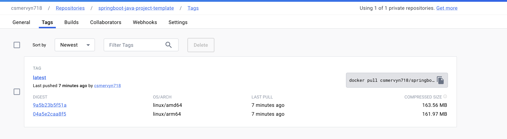

# Build multiple platforms and architecture image
Docker buildx is a plugin. It extends the building ability of images by using the BuildKit builder. Hence, with the plugin, we can build images for different platforms and architectures.
## Prerequisites
- Colima
- MAC os
## Install buildx
It didn't install the buildx docker plugin by default if we use colima. You get following error if you check the buildx version.
1. Check the buildx version
```shell
docker buildx version
```
The error we got.
```text
docker: 'buildx' is not a docker command.
See 'docker --help'
```
2. That means we need install buildx, and we can use brew to install buildx if you use MAC OS.
```shell
brew install docker-buildx
``
output:
```text
==> Fetching docker-buildx
==> Downloading https://ghcr.io/v2/homebrew/core/docker-buildx/blobs/sha256:316f90184d51579d9e80a5a38a3d93c176c8d55375215c4831a7a99db978eaa4
#################################################################################################################################################################### 100.0%
==> Pouring docker-buildx--0.12.0.arm64_sonoma.bottle.tar.gz
==> Caveats
docker-buildx is a Docker plugin. For Docker to find this plugin, symlink it:
  mkdir -p ~/.docker/cli-plugins
  ln -sfn /opt/homebrew/opt/docker-buildx/bin/docker-buildx ~/.docker/cli-plugins/docker-buildx

zsh completions have been installed to:
  /opt/homebrew/share/zsh/site-functions
==> Summary
🍺  /opt/homebrew/Cellar/docker-buildx/0.12.0: 26 files, 57.1MB
==> Running `brew cleanup docker-buildx`...
Disable this behaviour by setting HOMEBREW_NO_INSTALL_CLEANUP.
Hide these hints with HOMEBREW_NO_ENV_HINTS (see `man brew`).
```
**Notice: We need to follow the caveats mentioned in the install instructions:**
```shell
mkdir -p ~/.docker/cli-plugins
ln -sfn /opt/homebrew/opt/docker-buildx/bin/docker-buildx ~/.docker/cli-plugins/docker-buildx
```
3. Check the buildx version again
```shell
docker buildx version
```
output:
```text
github.com/docker/buildx v0.12.0 542e5d810e4a1a155684f5f3c5bd7e797632a12f
```
That output means we finish the installment of buildx.
## Building with buildx
1. Prepare your Dockerfile
2. Check the buildx builder
```shell
docker buildx ls
```
output:
```shell
NAME/NODE    DRIVER/ENDPOINT  STATUS  BUILDKIT             PLATFORMS
colima *     docker
  colima     colima           running v0.11.7+d3e6c1360f6e linux/arm64, linux/amd64, linux/amd64/v2
default                       error
```
3. Create buildx builder
If all the builder doesn't supports the platforms we want, you can use following command to create new one.
```shell
docker buildx create  --name mybuilder
```
4. Switch to your new builder
If your current builder not support multiple platforms we can use following command to switch buildx builder.
```shell
docker buildx use mybuilder
```
5. Bootstrap your builder
```shell
docker buildx inspect --bootstrap
```
output:
```text
[+] Building 4.9s (1/1) FINISHED                                                                                                                                      
 => [internal] booting buildkit                                                                                                                                  4.9s
 => => pulling image moby/buildkit:buildx-stable-1                                                                                                               3.5s
 => => creating container buildx_buildkit_mybuilder0                                                                                                             1.4s
Name:          mybuilder
Driver:        docker-container
Last Activity: 2023-12-15 01:29:28 +0000 UTC

Nodes:
Name:      mybuilder0
Endpoint:  colima
Status:    running
Buildkit:  v0.12.4
Platforms: linux/arm64, linux/amd64, linux/amd64/v2
Labels:
 org.mobyproject.buildkit.worker.executor:         oci
 org.mobyproject.buildkit.worker.hostname:         1dfa24e37408
 org.mobyproject.buildkit.worker.network:          host
 org.mobyproject.buildkit.worker.oci.process-mode: sandbox
 org.mobyproject.buildkit.worker.selinux.enabled:  false
 org.mobyproject.buildkit.worker.snapshotter:      overlayfs
GC Policy rule#0:
 All:           false
 Filters:       type==source.local,type==exec.cachemount,type==source.git.checkout
 Keep Duration: 48h0m0s
 Keep Bytes:    488.3MiB
GC Policy rule#1:
 All:           false
 Keep Duration: 1440h0m0s
 Keep Bytes:    5.588GiB
GC Policy rule#2:
 All:        false
 Keep Bytes: 5.588GiB
GC Policy rule#3:
 All:        true
 Keep Bytes: 5.588GiB
```
if you check your builders again:
```shell
docker buildx ls
```
you will find your builder is running.
```text
NAME/NODE    DRIVER/ENDPOINT  STATUS  BUILDKIT             PLATFORMS
mybuilder *  docker-container                              
  mybuilder0 colima           running v0.12.4              linux/arm64, linux/amd64, linux/amd64/v2
colima       docker                                        
  colima     colima           running v0.11.7+d3e6c1360f6e linux/arm64, linux/amd64, linux/amd64/v2
```
now we can build our images.
6. Build images and push
You can directyl follow the `Final try` section.
- My first try(failed)
```shell
cd app
docker buildx build  -t csmervyn718/springboot-java-project-template:latest --platform=linux/arm64,linux/amd64 .
```
output:
```text
[+] Building 10.5s (14/14) FINISHED                                                                                                        docker-container:mybuilder
 => [internal] load build definition from Dockerfile                                                                                                             0.0s
 => => transferring dockerfile: 208B                                                                                                                             0.0s
 => [linux/arm64 internal] load metadata for docker.io/library/amazoncorretto:17-alpine3.18-jdk                                                                  2.3s
 => [linux/amd64 internal] load metadata for docker.io/library/amazoncorretto:17-alpine3.18-jdk                                                                  2.2s
 => [auth] library/amazoncorretto:pull token for registry-1.docker.io                                                                                            0.0s
 => [internal] load .dockerignore                                                                                                                                0.0s
 => => transferring context: 2B                                                                                                                                  0.0s
 => [linux/amd64 1/3] FROM docker.io/library/amazoncorretto:17-alpine3.18-jdk@sha256:97077b491447b095b0fe8d6d6863526dec637b3e6f8f34e50787690b529253f3            0.0s
 => => resolve docker.io/library/amazoncorretto:17-alpine3.18-jdk@sha256:97077b491447b095b0fe8d6d6863526dec637b3e6f8f34e50787690b529253f3                        0.0s
 => [internal] load build context                                                                                                                                0.0s
 => => transferring context: 97B                                                                                                                                 0.0s
 => [linux/arm64 1/3] FROM docker.io/library/amazoncorretto:17-alpine3.18-jdk@sha256:97077b491447b095b0fe8d6d6863526dec637b3e6f8f34e50787690b529253f3            0.0s
 => => resolve docker.io/library/amazoncorretto:17-alpine3.18-jdk@sha256:97077b491447b095b0fe8d6d6863526dec637b3e6f8f34e50787690b529253f3                        0.0s
 => CACHED [linux/arm64 2/3] WORKDIR /app                                                                                                                        0.0s
 => CACHED [linux/arm64 3/3] COPY build/libs/app.jar .                                                                                                           0.0s
 => CACHED [linux/amd64 2/3] WORKDIR /app                                                                                                                        0.0s
 => CACHED [linux/amd64 3/3] COPY build/libs/app.jar . 
WARNING: No output specified with docker-container driver. Build result will only remain in the build cache. To push result image into registry use --push or to load image into docker use --load
```
**If you try to build image in this way you will get a WARNING. That WARNING tell us the image in the cache and we need load it into docker or push it to docker hub.**
- My second try(failed)
```shell
cd app
docker buildx build --load -t csmervyn718/springboot-java-project-template:latest --platform=linux/arm64,linux/amd64 .
```
output:
```shell
ERROR: docker exporter does not currently support exporting manifest lists
```
**The reason is we put one more argument for platform(`linux/arm64,linux/amd64`). We can just pass one value to above command and build it one by one or we use `--push` parameter and push these images to docker hub. We opt for the latter choice here.** 
- Final try(successes)
```shell
docker login
```
```shell
cd app
docker buildx build  -t csmervyn718/springboot-java-project-template:latest --platform=linux/arm64,linux/amd64 . --push
```
output:
```text
[+] Building 10.5s (14/14) FINISHED                                                                                                        docker-container:mybuilder
 => [internal] load build definition from Dockerfile                                                                                                             0.0s
 => => transferring dockerfile: 208B                                                                                                                             0.0s
 => [linux/arm64 internal] load metadata for docker.io/library/amazoncorretto:17-alpine3.18-jdk                                                                  2.3s
 => [linux/amd64 internal] load metadata for docker.io/library/amazoncorretto:17-alpine3.18-jdk                                                                  2.2s
 => [auth] library/amazoncorretto:pull token for registry-1.docker.io                                                                                            0.0s
 => [internal] load .dockerignore                                                                                                                                0.0s
 => => transferring context: 2B                                                                                                                                  0.0s
 => [linux/amd64 1/3] FROM docker.io/library/amazoncorretto:17-alpine3.18-jdk@sha256:97077b491447b095b0fe8d6d6863526dec637b3e6f8f34e50787690b529253f3            0.0s
 => => resolve docker.io/library/amazoncorretto:17-alpine3.18-jdk@sha256:97077b491447b095b0fe8d6d6863526dec637b3e6f8f34e50787690b529253f3                        0.0s
 => [internal] load build context                                                                                                                                0.0s
 => => transferring context: 97B                                                                                                                                 0.0s
 => [linux/arm64 1/3] FROM docker.io/library/amazoncorretto:17-alpine3.18-jdk@sha256:97077b491447b095b0fe8d6d6863526dec637b3e6f8f34e50787690b529253f3            0.0s
 => => resolve docker.io/library/amazoncorretto:17-alpine3.18-jdk@sha256:97077b491447b095b0fe8d6d6863526dec637b3e6f8f34e50787690b529253f3                        0.0s
 => CACHED [linux/arm64 2/3] WORKDIR /app                                                                                                                        0.0s
 => CACHED [linux/arm64 3/3] COPY build/libs/app.jar .                                                                                                           0.0s
 => CACHED [linux/amd64 2/3] WORKDIR /app                                                                                                                        0.0s
 => CACHED [linux/amd64 3/3] COPY build/libs/app.jar .                                                                                                           0.0s
 => exporting to image                                                                                                                                           8.2s
 => => exporting layers                                                                                                                                          0.0s
 => => exporting manifest sha256:04a5e2caa8f5711479339ef14ccec94ea614f681f6ba4b40d0e955f883e58697                                                                0.0s
 => => exporting config sha256:6f9b33784bd5479fcd7475bf280d1a0abae9179df570df91ef41405513aea247                                                                  0.0s
 => => exporting attestation manifest sha256:19dedb2b3f94d77bcd24ae88673d7e3c0ae4efdc315368df035460dd1e1ca488                                                    0.0s
 => => exporting manifest sha256:9a5b23b5f51a9d6d7adca985c68653d7d7a1faccdb64b9bc86852f1f617ea688                                                                0.0s
 => => exporting config sha256:844b71205f16a460c33391e493ba6cd761257fab9f93d86dc95ed1bc8751d1e9                                                                  0.0s
 => => exporting attestation manifest sha256:96fb1669c3de3b3c4eef11a4f3c173216f4305841bd6ba50ca8e2d641e5f1be5                                                    0.0s
 => => exporting manifest list sha256:5c9e3fdbffabad50e1f775a87e05f50dff84d85d8ae553b1cdf3db75e1b4ed12                                                           0.0s
 => => pushing layers                                                                                                                                            4.9s
 => => pushing manifest for docker.io/csmervyn718/springboot-java-project-template:latest@sha256:5c9e3fdbffabad50e1f775a87e05f50dff84d85d8ae553b1cdf3db75e1b4ed  3.2s
 => [auth] csmervyn718/springboot-java-project-template:pull,push token for registry-1.docker.io  
```
When above finished, we can check these images in docker hub.

## Verify the image
1. pull image
```shell
docker pull csmervyn718/springboot-java-project-template:latest
```
2. Run
```shell
docker run -p 8080:8080 csmervyn718/springboot-java-project-template
```
output:
```text

  .   ____          _            __ _ _
 /\\ / ___'_ __ _ _(_)_ __  __ _ \ \ \ \
( ( )\___ | '_ | '_| | '_ \/ _` | \ \ \ \
 \\/  ___)| |_)| | | | | || (_| |  ) ) ) )
  '  |____| .__|_| |_|_| |_\__, | / / / /
 =========|_|==============|___/=/_/_/_/
 :: Spring Boot ::                (v3.2.0)

2023-12-16T09:16:45.432Z  INFO 1 --- [           main] SpringBootJavaProjectTemplateApplication : Starting SpringBootJavaProjectTemplateApplication using Java 17.0.9 with PID 1 (/app/app.jar started by root in /app)
2023-12-16T09:16:45.436Z  INFO 1 --- [           main] SpringBootJavaProjectTemplateApplication : No active profile set, falling back to 1 default profile: "default"
2023-12-16T09:16:46.254Z  INFO 1 --- [           main] o.s.b.w.embedded.tomcat.TomcatWebServer  : Tomcat initialized with port 8080 (http)
2023-12-16T09:16:46.262Z  INFO 1 --- [           main] o.apache.catalina.core.StandardService   : Starting service [Tomcat]
2023-12-16T09:16:46.262Z  INFO 1 --- [           main] o.apache.catalina.core.StandardEngine    : Starting Servlet engine: [Apache Tomcat/10.1.16]
2023-12-16T09:16:46.294Z  INFO 1 --- [           main] o.a.c.c.C.[Tomcat].[localhost].[/]       : Initializing Spring embedded WebApplicationContext
2023-12-16T09:16:46.295Z  INFO 1 --- [           main] w.s.c.ServletWebServerApplicationContext : Root WebApplicationContext: initialization completed in 761 ms
2023-12-16T09:16:46.559Z  INFO 1 --- [           main] o.s.b.w.embedded.tomcat.TomcatWebServer  : Tomcat started on port 8080 (http) with context path ''
2023-12-16T09:16:46.576Z  INFO 1 --- [           main] SpringBootJavaProjectTemplateApplication : Started SpringBootJavaProjectTemplateApplication in 1.626 seconds (process running for 2.18)
2023-12-16T09:16:55.768Z  INFO 1 --- [nio-8080-exec-1] o.a.c.c.C.[Tomcat].[localhost].[/]       : Initializing Spring DispatcherServlet 'dispatcherServlet'
2023-12-16T09:16:55.769Z  INFO 1 --- [nio-8080-exec-1] o.s.web.servlet.DispatcherServlet        : Initializing Servlet 'dispatcherServlet'
2023-12-16T09:16:55.772Z  INFO 1 --- [nio-8080-exec-1] o.s.web.servlet.DispatcherServlet        : Completed initialization in 3 ms
```
If you run following command, you will see `Hello world`. That means our image works well.
```shell
curl http://localhost:8080/hello
```
## Reference
- [使用 buildx 构建跨平台镜像](https://xie.infoq.cn/article/b506022a7c190cda840eeb78c)
- [Colima-Docker buildx plugin is missing](https://github.com/abiosoft/colima/blob/main/docs/FAQ.md#docker-buildx-plugin-is-missing)
- [利用buildx构建支持多CPU架构平台的docker镜像](https://wiki.eryajf.net/pages/95cf71/#%E5%90%AF%E7%94%A8-buildx-%E6%8F%92%E4%BB%B6)
- [Introduction to Docker Buildx](https://www.baeldung.com/ops/docker-buildx)
